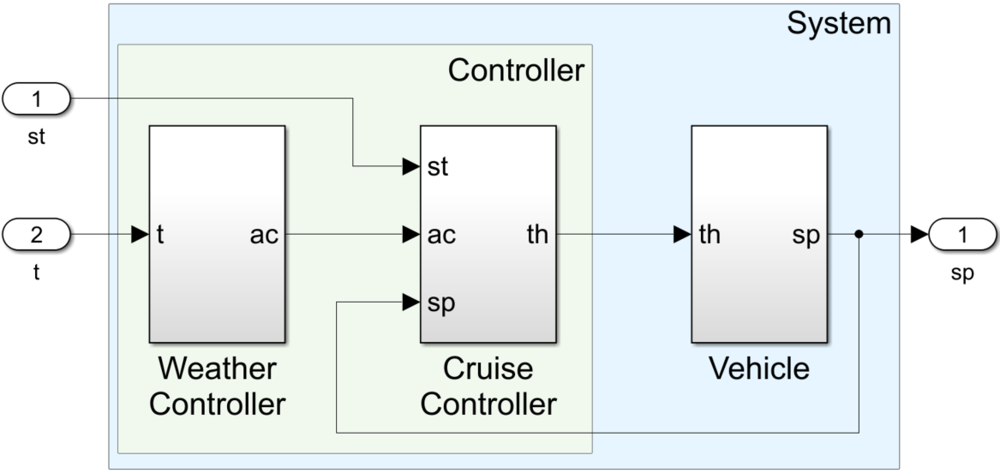

# Motivating Example

This folder contains the motivating example of the paper.



## Folder

Each folder has two contracts:

- `cc.rt` the contract of the _Cruise Controller_
- `we.rt` the contract of the _Weather Controller_

First, we run the composition, obtaining `composition.rt`.
Then, we run the refinement, checking if `composition.rt` refines `controlled_vehicle.rt`.

- `first` contains the first configuration
- `second` and `third` are two possible OTA of the `first` configuration, updating the _Cruise Controller_ contract
- `controlled_vehicle.rt` is the contract that the composition must always respect.

## Configuration

You need to save the JAR file in this folder before running the tests

## Run

```terminal
./motivating.sh
```

The script run the composition and then the refinement for all the configurations (`first`, `second`, and `third`).

## Results

- `first`: refinement ok
- `second`: refinement ok, OTA recommended
- `third`: refinement fails, OTA not recommended
